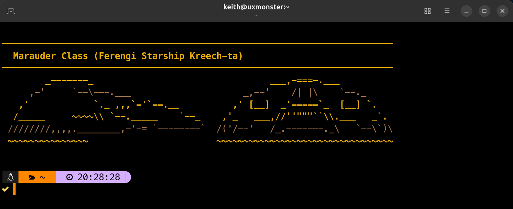

# trekscii

Random colorized Star Trek ASCII art for your login shell. One ship, station, or
insignia — in a randomly chosen faction color scheme — every time you open a
terminal.



Written in C, no dependencies, runs in about a millisecond.

Works on Linux and macOS, in zsh or bash. All you need to build it is a C
compiler — `cc`, `gcc`, or `clang`, whichever you already have.

## Install

```sh
git clone https://github.com/keithbphillips/trekscii.git
cd trekscii
./install.sh
```

That builds the binary and installs:

| What | Where |
| --- | --- |
| the `trekscii` executable | `~/.local/bin/trekscii` |
| the art files | `~/.local/share/trekscii_art/` |
| a startup hook | `~/.zshrc` or `~/.bashrc` |

The startup hook is a small block between `# >>> trekscii >>>` and
`# <<< trekscii <<<` markers. It puts `~/.local/bin` on your `PATH` if it isn't
already, then runs `trekscii` once per login session — nested shells, subshells,
and new tmux panes stay quiet, thanks to a `TREKSCII_GREETED` guard.

Open a new terminal to see it.

### Installer options

```sh
./install.sh --shell bash            # force which rc file to hook (zsh|bash|both|none)
./install.sh --no-shell-init         # install the files, leave rc files alone
sudo ./install.sh --prefix /usr/local  # system-wide
```

### Or just use make

```sh
make                    # build ./build/trekscii
make run                # build and run against ./art
make install            # install to ~/.local (no shell hook)
PREFIX=/usr/local sudo make install
```

## Uninstall

```sh
./uninstall.sh
```

Removes the binary, the art directory, and the rc file block. Add
`--prefix /usr/local` if that's where you installed it.

## Usage

```
trekscii              print a random piece
trekscii --list       list the available art files
trekscii --help       show help
trekscii --version    show the version
```

### Where the art comes from

`trekscii` looks for its art directory in this order, taking the first that
exists:

1. `$TREKSCII_ART_DIR`
2. `$XDG_DATA_HOME/trekscii_art` (defaults to `~/.local/share/trekscii_art`)
3. `../share/trekscii_art` relative to the executable
4. `art/` next to the executable — so a build in a source checkout just works
5. `/usr/local/share/trekscii_art`, then `/usr/share/trekscii_art`

## Adding your own art

Drop a `.txt` file into `~/.local/share/trekscii_art/` (or `art/` in the
checkout, then re-run `./install.sh`). The format is:

```
Title Of The Piece
<blank line, optional>
   the ASCII art
   ...
```

Line 1 is the title shown in the header bar. Everything after it is the art;
leading and trailing blank lines are trimmed. Lines are colored in a repeating
3-color cycle from the chosen scheme, so art that reads well in flat color works
best. Keep lines under 512 characters and pieces under 512 lines.

## Layout

```
LICENSE                MIT, covering the code (not the art - see below)
art/                   the art pieces, installed to ~/.local/share/trekscii_art
src/trekscii.c         the program
install.sh             build + install + shell hook
uninstall.sh           undo install.sh
Makefile               plain build/install targets
tools/trekscii.py      reference Python implementation, handy for tweaking output
tools/star-trek-ascii-compendium.txt
                       the original compendium the art was split out of
docs/screenshot.png    the README screenshot
docs/social-preview.png
                       1280x640 card for the repo's GitHub social preview
```

## Credits

The ASCII art is from the Star Trek ASCII-Art Compendium collected by
*-=Falcon=-* (Star-Trek Compendium Keeper), which in turn gathered work from
many uncredited artists. The original compendium file is preserved in
`tools/star-trek-ascii-compendium.txt`. Thanks to everyone who drew a starship
out of slashes and underscores.

The code is mine; the art is theirs. If you own a piece in here and want it
removed or properly credited, open an issue.

## License

The trekscii code and packaging — `src/`, `tools/`, `install.sh`,
`uninstall.sh`, `Makefile`, `README.md` — are [MIT licensed](LICENSE). Do what
you like with them.

The ASCII art in `art/`, the original compendium in `tools/`, and the art shown
in the `docs/` images are **not** covered by that license. They are
third-party works, included as-is, with no rights granted or claimed by this
project. See Credits above.
